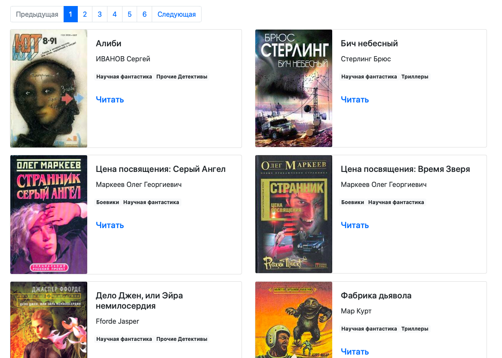

# Парсер книг с сайте [tululu.org](https://tululu.org/)

Скрипт позволяет скачать книги по фантастике в txt формате из бесплатной 
библиотеки [tululu](https://tululu.org/). Скаченные книги выкладывается на сайт.

## Как установить

Для запуска скрипта у вас уже должен быть установлен Python 3.

- Скачайте код;
- Установите зависимости командой 
```bash
$ pip install -r requirements.txt
```
- Запустите скрипт командой 
```bash
$ python3 parse_tululu_category.py
```

- Запуск формирования HTML страничек
```bash
$ python3 render_website.py
```

Скаченные текста книг хранятся в папке `books`, а их обложки в папке 
`images`.
HTML странички хранятся в папке `pages`.

## Аргументы

Доступны следующие аргументы командной строки:
- `--start_page` - номер начальной страницы **(По умолчанию - 1);**
- `--end_page` - номер конечной страницы, книги с которой будут скачены **(По умолчанию - вычисляется автоматически);**
- `--dest_folder` — путь к каталогу с результатами парсинга: картинкам, книгам, JSON. **(По умолчанию - текущий каталог);**
- `--skip_imgs` — не скачивать картинки **(По умолчанию - False);**
- `--skip_txt` — не скачивать книги **(По умолчанию - False);**
- `--json_path` — указать свой путь к *.json файлу с результатами **(По умолчанию - book_descriptions.json);**

Пример использования
```bash
$ python3 parse_tululu_category.py --end_page 3 --skip_txt
```
В этом случае скачаются все страницы с 1-ой по 3-ую включительно без текста.

## Сайт на GitHub Pages

Пример готового сайта можно увидеть по [ссылке](https://alex-men-vl.github.io/library-parser/pages/index1.html).



## Цель проекта

Код написан в образовательных целях на онлайн-курсе для веб-разработчиков [dvmn.org](https://dvmn.org/)
